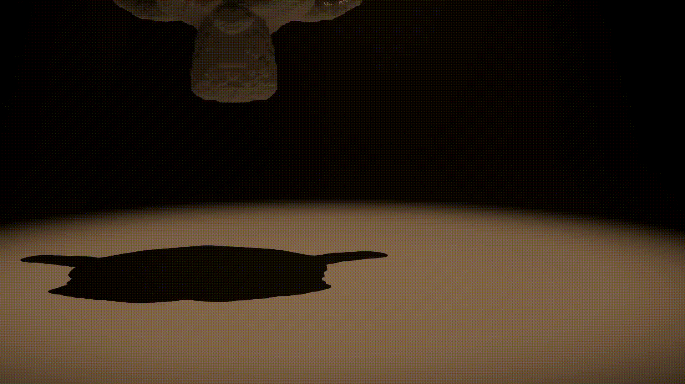

# 3D MPM Snow Simulator

[](https://github.com/Olympus204/Stomakhin-style-snow-simulator/actions/workflows/ci.yml)

A three-dimensional Material Point Method snow simulator written in C++20,
based on the elastoplastic snow model described by Stomakhin et al.

The project implements the simulation pipeline from particle-grid transfer
through elastoplastic deformation and collision handling, with Blender tools
for generating particle initial conditions from meshes and importing
simulation output for visualisation.



## Features

- 3D Material Point Method simulation
- Elastoplastic snow using multiplicative deformation decomposition
  `F = F_E F_P`
- Cubic B-spline particle-grid interpolation
- PIC/FLIP velocity transfer
- Snow hardening and plastic projection
- Frictional collision handling
- Sparse active grid using `std::unordered_map`
- OpenMP parallelisation
- Blender mesh-to-particle seeding
- Blender frame import and playback
- Numerical and regression tests through CTest

## Simulation pipeline

Each timestep follows the standard MPM particle-grid-particle structure:

```text
Particles
   │
   ▼
Build cubic B-spline stencils
   │
   ▼
Particle-to-grid transfer
   │
   ├── mass
   └── momentum
   │
   ▼
Compute constitutive forces
   │
   ▼
Update grid velocities
   │
   ▼
Grid collisions
   │
   ▼
Update elastic/plastic deformation
   │
   ▼
Grid-to-particle PIC/FLIP transfer
   │
   ▼
Particle collisions and position update
```
Particles carry position, velocity, mass, rest volume, and separate elastic
and plastic deformation gradients. The background grid is reconstructed each
step and contains only nodes touched by particle interpolation stencils.

## Snow model
The constitutive model follows the approach of Stomakhin et al. and splits
the deformation gradient into elastic and plastic components:
\[
F = F_E F_P
\]
Elastic deformation determines the stress response, while singular values of
the trial elastic deformation are projected to compression and stretch limits.
The remaining deformation is transferred into the plastic component.
Material stiffness increases with plastic compression through an exponential hardening term, allowing compacted snow to become progressively stiffer.
The current implementation models elastoplastic deformation but does not
include a fracture or damage criterion. Highly stressed material can deform
and compact permanently, but cohesive regions do not explicitly crack into
separate pieces.

## Blender workflow
The Blender utilities in `blender/` provide the front and back ends of the
simulation workflow.

### Particle seeding
Closed Blender meshes can be sampled into regularly spaced material points.
Each enabled snow group can specify:

- particle spacing
- particle mass
- initial velocity

The exporter converts Blender coordinates into the solver coordinate system
and writes:
- input/groups.csv
- input/particles.csv

### Playback
The simulation writes particle positions for each output frame. The Blender
importer reads these frames back into Blender, where the particles can be
displayed or converted into renderable geometry.
```text
Blender mesh
     │
     ▼
Particle seeding
     │
     ▼
C++ MPM solver
     │
     ▼
CSV frame sequence
     │
     ▼
Blender playback / rendering
```

## Results

The solver produces permanent plastic deformation under impact while retaining
a coherent three-dimensional particle body.

The example scene included with the repository uses a tilted, elongated snow
body impacting a rigid ground plane. The asymmetric initial geometry makes
compression, shear and permanent deformation easier to observe than with a
symmetric sphere.


The current constitutive model does not include fracture, so material remains
cohesive under high deformation rather than breaking into separate fragments.

## Performance

Performance was measured throughout development using per-stage timing
instrumentation rather than optimising from inspection alone.

| Optimisation | Measured result |
| --- | ---: |
| `std::map` → `std::unordered_map` sparse grid | ~23.36 s → ~6.04 s per frame, 3.87× faster |
| Hoisted particle-constant force matrix outside stencil loop | Force accumulation ~30.1 s → ~23.6 s |
| Cached `GridNode*` references in particle stencils | Force accumulation 156.9 s → 59.1 s on a 643,829-particle test |
| Reserved sparse-grid capacity | P2G ~128–131 s → ~117–119 s on the same large test |

These measurements were taken using controlled test scenes and are intended
to measure the effect of individual implementation changes rather than act as
general-purpose performance benchmarks.

## Building

### Requirements

- C++20 compiler
- CMake 3.20 or later
- Eigen3
- OpenMP
- Ninja (recommended)

Configure and build:

```bash
cmake -S . -B build -G Ninja
cmake --build build
```
Run the example simulation:
```bash
./build/snow_sim
```
simulation frames are written to `output/`

## Tests

The test suite validates both individual numerical components and physical
invariants of the solver. Tests include cubic B-spline interpolation and
derivatives, P2G mass and momentum conservation, translation invariance,
particle volume estimation, constitutive forces, collision responses,
elastic and plastic deformation updates, linear velocity-field reproduction,
PIC/FLIP transfer and particle integration.

Tests are registered with CTest and can be run with:

```bash
ctest --test-dir build --output-on-failure
```

## Project structure

```text
.
├── blender/        Blender seeding and playback tools
├── include/snow/   Solver headers
├── input/          Example initial conditions
├── src/            C++ solver implementation
├── tests/          Numerical and regression tests
└── CMakeLists.txt
```

## Current limitations

The public solver currently uses explicit time integration. Stiff material
parameters therefore require small timesteps for numerical stability.

Collision geometry is currently represented by analytic rigid bodies rather
than arbitrary animated meshes.

The constitutive model captures elastoplastic deformation and hardening but
does not include an explicit damage or fracture criterion. Highly stressed
snow therefore remains cohesive rather than cracking into independent chunks.

## Reference

This implementation is based on:

> Alexey Stomakhin, Craig Schroeder, Lawrence Chai, Joseph Teran and Andrew
> Selle. *A Material Point Method for Snow Simulation*. ACM SIGGRAPH, 2013.
