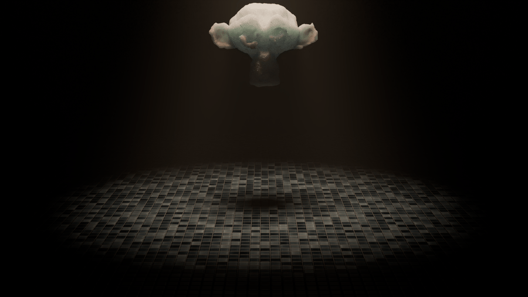
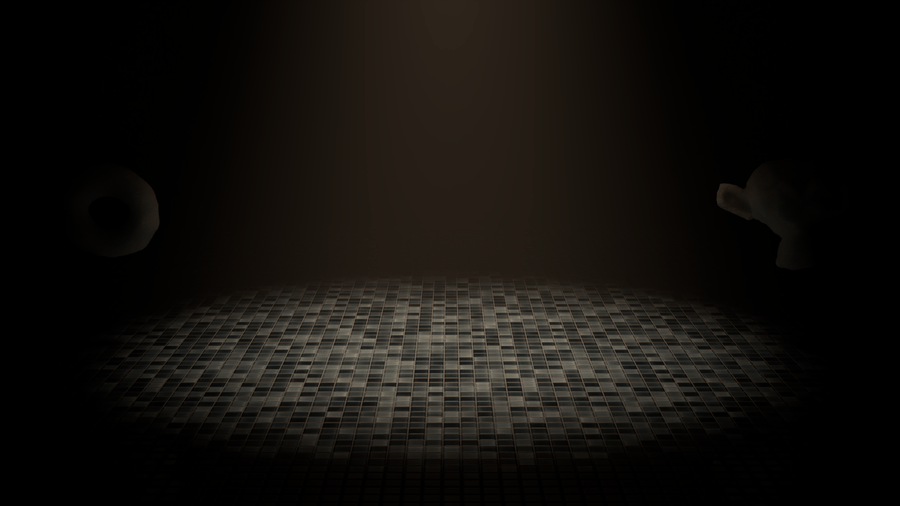
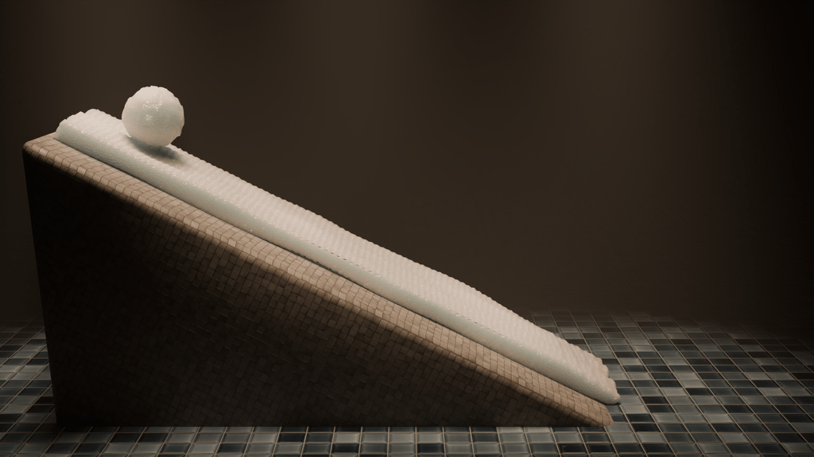

# 3D MPM Snow Simulator

[](https://github.com/Olympus204/Stomakhin-style-snow-simulator/actions/workflows/ci.yml)

A three-dimensional Material Point Method snow simulator written in C++20,
based on the elastoplastic snow model introduced by Stomakhin et al.

The project implements both explicit and semi-implicit MPM integration,
elastoplastic snow deformation, sparse particle-grid transfers, frictional
collisions, and a custom particle-to-surface reconstruction pipeline using
Marching Cubes. Blender tools provide mesh-based particle seeding and rendering
of the resulting particle and surface animations.



## Features

### Simulation

- Three-dimensional Material Point Method
- Elastoplastic snow with multiplicative deformation decomposition
  `F = F_E F_P`
- Cubic B-spline particle-grid interpolation
- PIC/FLIP velocity transfer
- Plastic projection with compression and stretch limits
- Exponential snow hardening
- Frictional analytic collision bodies
- Sparse active grid using `std::unordered_map`
- OpenMP parallelisation

### Time integration

- Explicit integration
- Semi-implicit integration using a matrix-free linear operator
- Constitutive and deformation differentials for force linearisation
- Conjugate Residual iterative solve
- Symmetric mass scaling / preconditioning
- Runtime selection between explicit and semi-implicit solvers

### Surface reconstruction

- Particle-volume reconstruction onto a scalar field
- Sparse tracking of cubes affected by particles
- Marching Cubes surface extraction
- Edge-based vertex caching and indexed mesh generation
- OBJ frame export for rendering
- Vertex deduplication across neighbouring cubes

### Tooling

- Blender mesh-to-particle seeding
- Per-object particle mass, spacing and initial velocity
- Particle-frame export
- Blender particle and surface import
- Per-stage simulation timing
- Numerical and regression tests through CTest
- Continuous integration through GitHub Actions

## Simulation pipeline

Each timestep follows the standard MPM particle-grid-particle structure:

```text
Particles
   │
   ▼
Build cubic B-spline stencils
   │
   ▼
Particle-to-grid transfer
   │
   ├── mass
   └── momentum
   │
   ▼
Evaluate elastoplastic constitutive model
   │
   ▼
Grid velocity update
   │
   ├── Explicit
   │
   └── Semi-implicit
          │
          ├── linearise force response
          ├── build matrix-free operator
          ├── symmetric mass scaling
          └── Conjugate Residual solve
   │
   ▼
Grid collisions
   │
   ▼
Update elastic/plastic deformation
   │
   ▼
Grid-to-particle PIC/FLIP transfer
   │
   ▼
Particle collisions
   │
   ▼
Position update
```

Particles carry position, velocity, mass, rest volume, and separate elastic
and plastic deformation gradients. The background grid is rebuilt every
timestep and contains only nodes touched by particle interpolation stencils.

The solver can switch between explicit and semi-implicit integration through
`SolverType` without changing the remainder of the simulation pipeline.
## Snow model
The constitutive model follows Stomakhin et al. and decomposes the total
deformation gradient into elastic and plastic components: `F = F_E F_P`

`F_E` determines the elastic stress response. After each deformation update,
the singular values of the trial elastic deformation are clamped to prescribed
compression and stretch limits. The remaining deformation is transferred into `F_P`, producing permanent plastic deformation.

Material stiffness increases with plastic compression through exponential
hardening, allowing compacted snow to become progressively more resistant to
further deformation.

The current model does not contain an explicit damage or fracture criterion.
Highly stressed snow can compress, shear and deform permanently, but cohesive
regions do not explicitly crack into independent fragments.

## Semi-implicit integration
The semi-implicit solver linearises the internal force response around the
current deformation state.

For a perturbation in grid velocity, the solver computes the corresponding
change in deformation gradient and evaluates the differential of the
constitutive model, including changes in:

- determinant `J`
- cofactor-like term `J F^-T`
- polar rotation
- elastic stress

The resulting linear system is applied in matrix-free form rather than
constructing a global sparse matrix explicitly.

A Conjugate Residual solver operates on the active grid nodes, with symmetric
mass scaling used to improve conditioning.

In a controlled stability comparison, the semi-implicit solver remained
stable with 40 substeps per rendered frame where the explicit solver required
200, corresponding to a 5x larger stable timestep for that scene.

This is a stability result rather than a claim of a 5x runtime speedup: each
semi-implicit substep is substantially more expensive because it requires an
iterative linear solve.
## Surface reconstruction
MPM naturally represents material as particles, but particle positions alone
are not suitable final render geometry. The project therefore includes a
custom surface reconstruction stage.

For each output frame:
```
MPM particles
     │
     ▼
Particle volumes
     │
     ▼
Cubic B-spline scalar field
     │
     ▼
Track active cubes
     │
     ▼
Marching Cubes
     │
     ▼
Edge-based vertex cache
     │
     ▼
Indexed triangle mesh
     │
     ▼
OBJ
     │
     ▼
Blender
```
Particle volume is estimated from the rest volume and current deformation.
Particles contribute to a reconstruction field using the same family of cubic
B-spline kernels used by the simulation.

Only cubes near particle contributions are considered during Marching Cubes,
avoiding traversal of the entire bounding volume.

Generated vertices are cached by their global grid edge rather than by
floating-point position. Adjacent cubes therefore share vertex indices,
producing a connected indexed mesh instead of three independent vertices per
triangle.

## Blender workflow
The tools in `blender/` provide the input and visualisation stages of the
pipeline.

### Particle seeding
Closed Blender meshes can be sampled into regularly spaced material points.
Each enabled snow group can specify:

- particle spacing
- particle mass
- particle velocity

The exporter converts Blender coordinates into the solver coordinate system
and writes the particle and group descriptions consumed by the C++ solver.

### Rendering
Simulation frames are written as particle data and can be reconstructed into
triangle meshes for rendering.

The complete workflow is:
```
Arbitrary Blender mesh
        │
        ▼
Particle seeding
        │
        ▼
C++ MPM simulation
        │
        ▼
Particle frame sequence
        │
        ▼
Surface reconstruction
        │
        ▼
Indexed OBJ sequence
        │
        ▼
Blender rendering
```

## Results

### Impact and plastic deformation
The simulator preserves a coherent three-dimensional snow body while producing
permanent deformation under impact.


### Collision between independently seeded bodies
Two independently seeded snow bodies collide at high relative velocity,
producing compression, shear and permanent plastic deformation.



The lack of a fracture model is particularly visible under severe impact:
material can deform extensively but does not explicitly separate through crack
formation.

### Snow accumulation on an incline

A snowball rolls down a 30-degree incline through a seeded layer of snow,
collecting and compacting material before shedding and depositing it further
down the slope.



## Performance
Performance optimisation was driven by per-stage timing instrumentation rather
than inspection alone.

| Optimisation                                                |                                                 Measured result |
| ----------------------------------------------------------- | --------------------------------------------------------------: |
| `std::map` -> `std::unordered_map` sparse grid              |                     ~23.36 s -> ~6.04 s per frame, 3.87x faster |
| Hoisted particle-constant force matrix outside stencil loop |                           Force accumulation ~30.1 s -> ~23.6 s |
| Cached `GridNode*` references in particle stencils          | Force accumulation 156.9 s -> 59.1 s on a 643,829-particle test |
| Reserved sparse-grid capacity                               |             P2G ~128-131 s -> ~117-119 s on the same large test |

These measurements come from controlled development scenes and are intended
to isolate the effect of individual implementation changes rather than serve
as general-purpose performance benchmarks.

Semi-implicit integration trades a more expensive individual timestep for a
substantially larger stable timestep. The appropriate solver therefore depends
on material stiffness and scene behaviour rather than raw substep cost alone.

## Building

### Requirements

- C++20 compiler
- CMake 3.20 or later
- Eigen3
- OpenMP
- Ninja (recommended)

Configure and build:

```bash
cmake -S . -B build -G Ninja
cmake --build build
```
Run the example simulation:
```bash
./build/snow_sim
```
Particle frames are written beneath `output/`.

## Tests

The test suite validates both individual numerical components and structural
properties required by the explicit and semi-implicit solvers.

Tests include:

- cubic B-spline interpolation and derivatives
- P2G mass and momentum conservation
- translation invariance and particle volume estimation
- constitutive force evaluation
- finite-difference validation of the constitutive differential
- elastic and plastic deformation updates
- deformation differential validation
- matrix-free operator linearity and symmetry
- symmetric mass scaling
- Conjugate Residual convergence
- collision constraints during the iterative solve
- PIC/FLIP transfer
- grid and particle collision responses
- particle integration
- particle-volume reconstruction
- Marching Cubes construction and interpolation

Tests are registered with CTest and can be run with:

```bash
ctest --test-dir build --output-on-failure

## Project structure

```text
.
├── assets/         Rendered simulation demonstrations
├── blender/        Blender seeding and import tools
├── include/snow/   Solver and reconstruction headers
├── input/          Example initial conditions
├── src/            C++ implementation
├── tests/          Numerical and regression tests
└── CMakeLists.txt
```

## Current limitations
- Collision geometry is represented by analytic rigid bodies rather than arbitrary animated collision meshes.
- The constitutive model does not include explicit damage or fracture.
- Surface reconstruction currently uses a fixed-resolution scalar grid rather than an adaptive spatial structure
- Surface extraction is performed independently for each frame, so temporal mesh connectivity is not preserved
- The current implementation targets CPU execution.

## Reference

This implementation is based on:

> Alexey Stomakhin, Craig Schroeder, Lawrence Chai, Joseph Teran and Andrew
> Selle. *A Material Point Method for Snow Simulation*. ACM SIGGRAPH, 2013.
